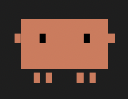

# 🤖 All Day Poke Desktop Pet

A minimalist desktop widget that floats over all windows, showing real-time Claude API token usage with an animated pixel-art robot that reacts to API activity.



## ✨ Features

- **Real-time token usage monitoring** - Shows your Anthropic API token usage as a percentage bar
- **Animated pixel-art robot** - Orange/terracotta themed robot that reacts to API activity
- **Auto-detection of API calls** - Three detection methods:
  - HTTP Proxy (most accurate)
  - Log file watching
  - Token usage changes
- **Countdown timer** - Shows time until token reset
- **Always on top** - Floats above all windows
- **Draggable** - Click and drag the robot to reposition
- **Transparent background** - Clean, minimal design

## 🚀 Quick Start

### Prerequisites
- Node.js installed (v16 or higher)
- Anthropic API key (get one at https://console.anthropic.com/settings/keys)

### Launch Instructions

1. **Install dependencies** (if not already done):
   ```bash
   npm install
   ```

2. **Set your API key** (choose one method):

   **Option A - Environment Variable (Recommended):**
   ```bash
   export ANTHROPIC_API_KEY="sk-ant-api03-your-key-here"
   npm start
   ```

   **Option B - Launch and use Setup Wizard:**
   ```bash
   npm start
   # The setup wizard will appear on first launch
   ```

   **Option C - Demo Mode (no API key):**
   ```bash
   npm start
   # Click "Skip" in the setup wizard
   ```

3. **The robot will appear** in the bottom-right corner of your screen!

## 🎮 Controls

- **Left Click + Drag** on robot: Move the widget
- **Right Click**: Open context menu
  - Reload
  - Open Config
  - Lock Position
  - DevTools (for debugging)
  - Quit

## 🔧 Configuration

### For Activity Detection

To enable accurate activity detection when using Claude Code, configure it to use the local proxy:

```bash
# Add to ~/.zshrc or ~/.bashrc
export ANTHROPIC_API_BASE="http://localhost:9999"
```

Then restart your terminal and Claude Code will route through the proxy.

### Config File Location

The config file is automatically created at:
- macOS/Linux: `~/.alldaypoke/config.json`
- Windows: `%USERPROFILE%\.alldaypoke\config.json`

### Config Options

```json
{
  "poll_interval_seconds": 30,        // How often to check token usage
  "activity_timeout_seconds": 10,     // Seconds before returning to idle
  "proxy_port": 9999,                 // Local proxy port
  "detection_method": "auto",         // auto|proxy|logs|tokens
  "position": { "x": null, "y": null }, // Window position
  "window_locked": false              // Lock window position
}
```

## 🤖 Robot States

The robot has two automatic states:

| State | Visual | Trigger |
|-------|--------|---------|
| **IDLE** | Slow floating, occasional blink | No API activity for 10+ seconds |
| **ACTIVE** | Vibrating, bright eyes, glowing | API call detected |

## 📊 Token Bar Colors

- 🟢 **Green** (<40% used): Plenty of tokens remaining
- 🟡 **Yellow** (40-70% used): Moderate usage
- 🔴 **Red** (>70% used): Running low, be careful!

## 🐛 Troubleshooting

### "No API key" message
- Make sure `ANTHROPIC_API_KEY` environment variable is set
- Or enter your key in the setup wizard

### Robot not detecting activity
1. Check if the proxy is running (port 9999)
2. Ensure Claude Code is configured to use the proxy
3. Check if log watching has permissions

### Widget off-screen
- Delete position from config file and restart
- Widget will reset to bottom-right corner

### Can't see the robot
- Make sure no full-screen apps are running
- Check if transparency is supported on your system
- Try reloading with right-click menu

## 🛠 Development

### Run in development mode:
```bash
npm run dev
```

### Project Structure:
```
desktop_bot/
├── main.js              # Electron main process
├── preload.js           # IPC bridge
├── proxy.js             # HTTP proxy server
├── watcher.js           # Log file watcher
├── usage-poller.js      # API usage polling
├── renderer/
│   ├── index.html       # Main widget UI
│   ├── setup.html       # Setup wizard
│   ├── style.css        # Widget styles
│   ├── robot.js         # Robot SVG generator
│   ├── stats.js         # Stats display logic
│   └── renderer.js      # Main renderer script
└── config/
    └── defaults.json    # Default configuration
```

## 📝 Notes

- The app stores your API key as an environment variable for the session
- Window position is saved automatically when you drag it
- The proxy only accepts connections from localhost for security
- All animations are CSS-based for smooth performance

## 🎉 Enjoy your new desktop companion!

The robot will keep you company while monitoring your Claude API usage. Happy coding! 🚀