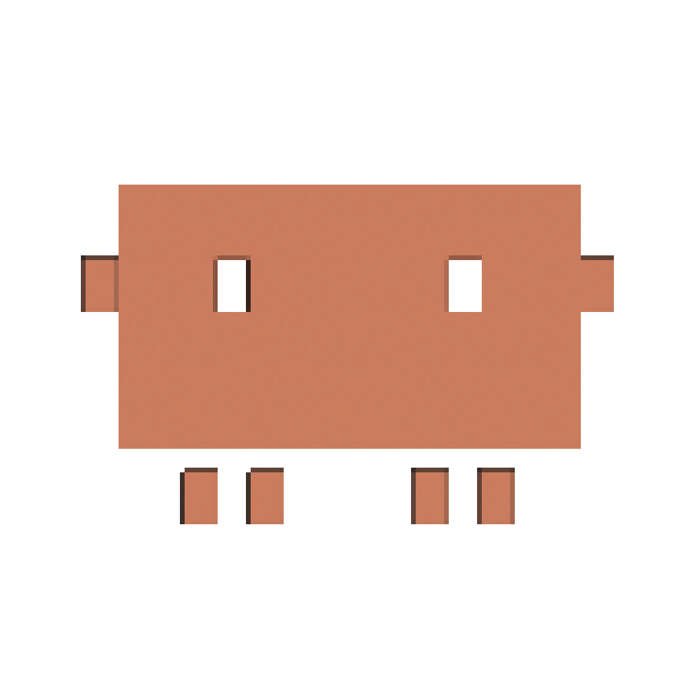

# All Day Poke

A desktop pet that tracks your Claude Code usage and lets you vibe-code with friends. It sits on top of all your windows as a tiny pixel robot, shows live session status, and syncs with a social leaderboard so you can see who's coding right now.



## Install

```bash
curl -fsSL https://raw.githubusercontent.com/serenakeyitan/desktop-claw/main/install.sh | bash
```

Or manually:

```bash
git clone https://github.com/serenakeyitan/desktop-claw.git
cd desktop-claw
npm install
npx alldaypoke
```

The app auto-starts on login once installed.

## What it does

### Live session tracking

The robot detects all running Claude Code sessions automatically — no configuration needed. It scans debug files, matches processes, and even picks up SSH sessions to remote machines. The bubble above the robot shows all active projects in green:

```
4 running: desktop_bot, peer-kael-claw, keyitan, remote:kael@59.110.165.69
```

Sessions actively executing tasks get a glow effect. When a task finishes, you get a desktop notification.

### Usage monitoring

Reads your Claude usage directly from the `/status` endpoint using your Claude Code OAuth credentials (pulled from macOS Keychain automatically). Shows:

- Token usage percentage with color-coded bar (green / yellow / red)
- Subscription tier (Pro, Max, Free)
- Reset countdown timer
- Per-project usage attribution — see which project is burning your tokens

### Social features

Sign up with a username, add friends via invite codes, and see who's vibing:

- **Live status** — see which friends have Claude Code open right now, with project names
- **Friend rankings** — compare usage across today, 7 days, 30 days, or all time
- **Global leaderboard** — top 50 users by usage
- **Poke** — tap a friend to send a poke. Their robot does a head-pat animation with floating hearts
- **Invite links** — share `alldaypoke://invite/CODE` deep links to add friends instantly

### The robot

A 12x8 pixel-art robot in terracotta orange that floats over all your windows:

- Eyes light up white when Claude is active, go dark when idle
- Vibrates and glows during API calls
- Blinks randomly when idle
- Blushes pink and squints when poked by a friend
- Scroll wheel to resize (0.3x to 1.5x)
- Drag to reposition anywhere on screen
- Click-through on transparent areas so it never blocks your work

## Controls

| Action | What it does |
|--------|-------------|
| Hover over robot | Show usage bubble with stats |
| Drag robot | Reposition the widget |
| Scroll wheel | Resize the robot |
| Right-click | Context menu |

### Context menu

- Change Authentication
- Reload
- Open Config
- Usage Ranking (per-project breakdown)
- Social Ranking (friends + global)
- Update Usage (manual entry)
- Lock Position
- DevTools
- Quit

## Configuration

Config lives at `~/.alldaypoke/config.json`:

```json
{
  "poll_interval_seconds": 30,
  "activity_timeout_seconds": 10,
  "proxy_port": 9999,
  "detection_method": "auto",
  "position": { "x": null, "y": null },
  "robot_scale": 0.6,
  "window_locked": false
}
```

## Architecture

```
desktop_bot/
├── main.js                    # Electron main process, IPC, windows
├── session-monitor.js         # Claude Code session detection (debug files + ps + SSH)
├── usage-tracker.js           # Per-project usage attribution
├── usage-db.js                # Local usage history (JSON-backed)
├── auto-usage-updater.js      # Polls Claude /status endpoint
├── claude-oauth-usage-tracker.js  # OAuth credential handling
├── social-sync.js             # Supabase social sync (status, rankings, pokes)
├── social-backend.js          # Server-side social queries
├── auth-manager.js            # Authentication (OAuth, API key, keychain)
├── logger.js                  # Dev/prod logging
├── proxy.js                   # Local HTTP proxy for API interception
├── watcher.js                 # Log file watcher
├── alldaypoke                 # CLI launcher script
├── renderer/
│   ├── index.html + renderer.js + style.css    # Main widget
│   ├── robot.js                                # Pixel-art robot renderer
│   ├── social.html + social.js + social.css    # Social window
│   ├── login.html + login.css                  # Auth flow
│   ├── ranking.html + ranking.js + ranking.css # Usage rankings
│   ├── setup.html + setup.css                  # First-run wizard
│   └── update-usage.html                       # Manual usage input
├── preload.js                 # Main window IPC bridge
├── preload-social.js          # Social window IPC bridge
└── preload-usage.js           # Usage modal IPC bridge
```

## Building

```bash
npm run dist          # macOS DMG (universal)
npm run dist:all      # macOS + Windows + Linux
```

## License

MIT
